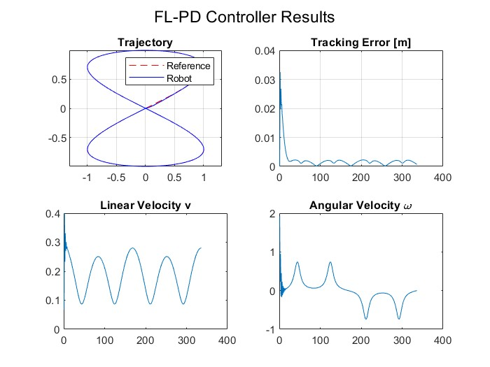
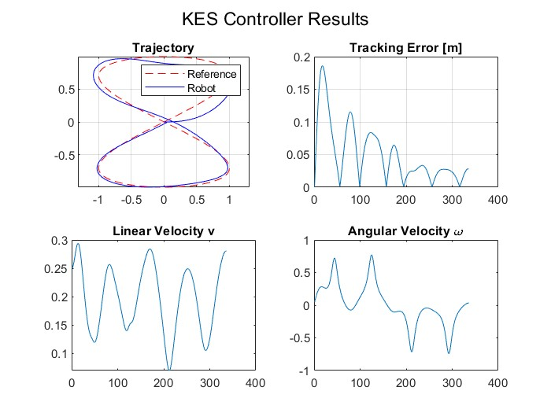
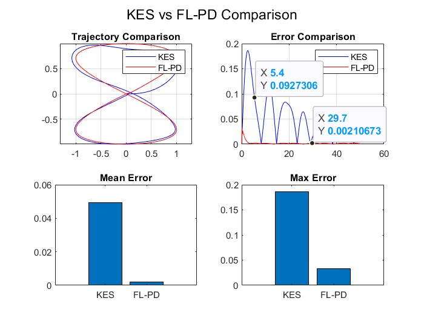
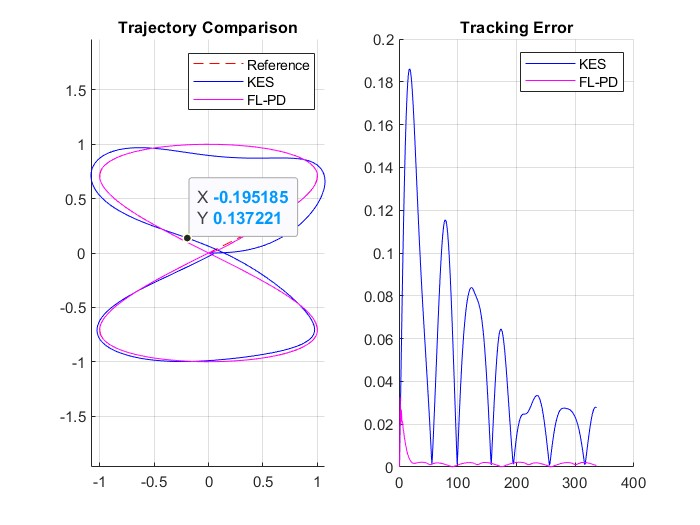

# 🚀 Differential Drive Robot – Trajectory Tracking (KES vs FL-PD)

This project implements and compares **two kinematic controllers** for a differential-drive mobile robot:

1. **KES Controller (Kinematic Error Stabilization / De Luca Method)**
2. **Feedback Linearization PD Controller (FL-PD)**

The robot is required to track a reference trajectory shaped like an “∞”.  
All code is implemented in **MATLAB**, following a modular and clean structure.

---

## 📂 Project Structure


```
📁 root/Project 
│── Main_control_code.m
│── Trajectory_Tracking_law.m
│── Controller_KES.m
│── Controller_FLPD.m
│── DiffDrive.m
│── unicycle_saturation.m
│── buildTrajectory.m
│── plotResults.m
│── /images
│ ├── FLPD-ControllerResults.jpg
│ ├── KESController.jpg
│ ├── KESvsFLPDComparison.jpg
│ ├── Trajectory_Tracking-KES-FLPD.jpg

```

Each controller and utility function is placed in a separate `.m` file to improve readability and maintainability.

---

## 📌 Requirements

- MATLAB R2021a or newer  
- No additional toolboxes required  
- `ode45` is used for numerical integration (included by default)

---

## ▶️ How to Run the Simulation

Simply execute:

`Main_control_code.m`

#### The script will:

- Generate the reference trajectory
- Run both control algorithms
- Apply wheel-speed saturation
- Simulate the robot through differential-drive kinematics
- Produce all performance plots

### 🧠 Controller Descriptions
#### 1️⃣ KES – Kinematic Error Stabilization
This controller:

- Converts the tracking error to the robot coordinate frame
- Adjusts linear velocity based on longitudinal error
- Uses a sinc-like term for angular error feedback
- Implements PD terms to stabilize the motion

It is simple, effective, and works well for moderately curved trajectories.

#### 2️⃣ FL-PD – Feedback Linearization + PD
This controller:

- Defines a virtual point b meters ahead of the robot
- Linearizes the mapping between control inputs (v, ω) and the virtual point velocity
- Applies PD control in the linearized space
- Achieves smoother and more precise tracking

FL-PD typically results in lower tracking error, especially for aggressive or rapidly changing trajectories.

### 📊 Simulation Results
- FL-PD Controller Results

- KES Controller Results

- KES vs FL-PD Comparison

- Trajectory Followed by Both Controllers


### 📈 Key Observations

#### ⭐ FL-PD Controller:
- Much lower mean and maximum tracking error
- Faster convergence
- Smoother velocity and orientation profiles

#### ⭐ KES Controller:
- Higher oscillations in error
- Less accurate tracking in transient behavior
- More sensitive to trajectory curvature

##### ➡️ FL-PD clearly outperforms the KES controller in accuracy and stability.

👥 Team: 

- Carlos Osmar Medina García A01198351@tec.mx

- Karina Fernanda Maldonado Murillo A01707516@tec.mx

Developed by students of
Mobile Robot Control – Tecnológico de Monterrey, 2025
